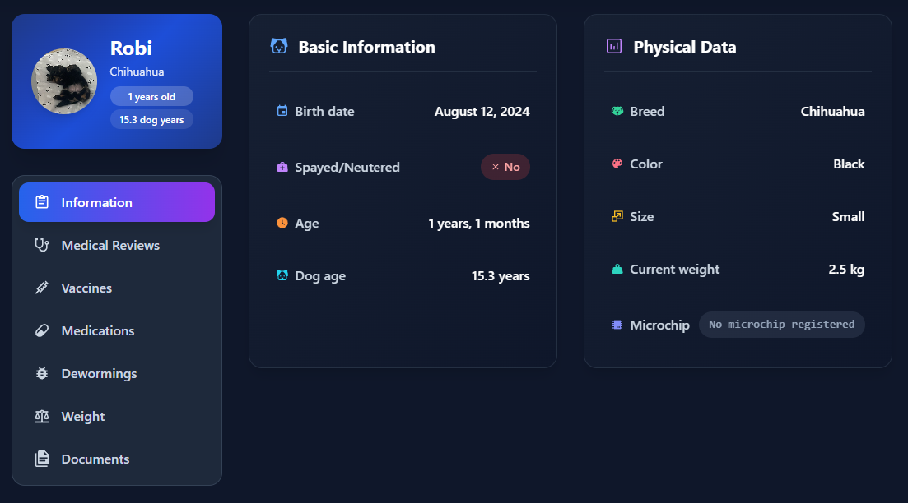
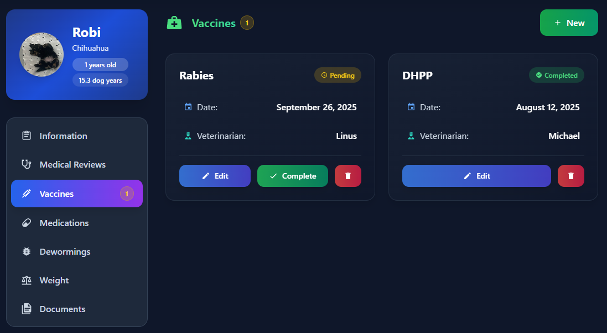
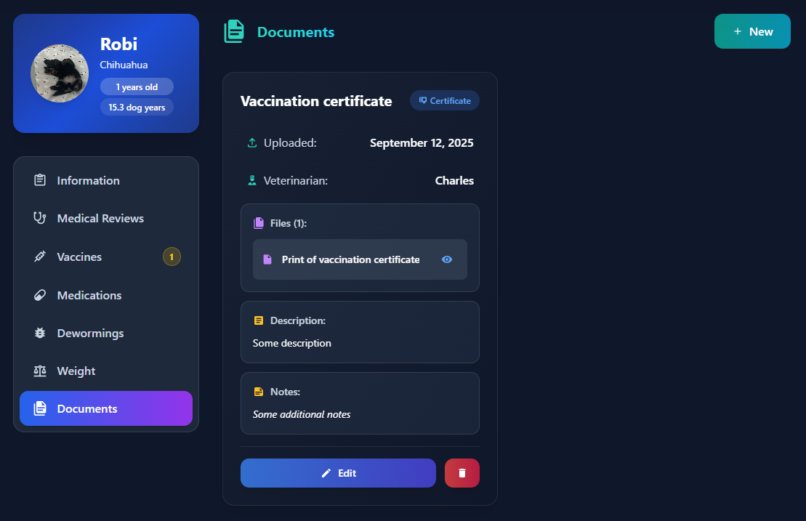

# 🐾 RobiPet - Complete Digital Pet Health Portfolio

<div align="center">


[](LICENSE)
[](https://reactjs.org/)
[](https://astro.build/)
[](https://www.php.net/)
[](https://www.typescriptlang.org/)

**The all-in-one digital health portfolio for your beloved pets** 🏥

[Demo](https://robipet.anghios.es/) • [Documentation](https://robipet.anghios.es/docs) • [Report Bug](https://github.com/anghios/robipet/issues) • [Request Feature](https://github.com/anghios/robipet/issues)

</div>

---

## ✨ Why RobiPet?

Managing your pet's health shouldn't be complicated. **RobiPet** transforms the way you track your pet's medical history, vaccinations, and vital information - all in one beautiful, intuitive interface.

<div align="center">


</div>
### 🎯 Key Features

- **📱 Complete Health Dashboard** - All your pet's information at your fingertips
- **💉 Smart Vaccination Tracking** - Never miss a vaccine with intelligent alerts
- **📊 Weight & Growth Monitoring** - Track your pet's development over time
- **📄 Document Management** - Store certificates, medical reports, and insurance
- **🔔 Automated Reminders** - Get notified for upcoming appointments and vaccines
- **🌐 Multi-Language Support** - Available in English, Spanish, and more
- **📱 Mobile-First Design** - Perfect on any device, anywhere

## 🚀 Quick Start

Get RobiPet running in seconds!

### 🔑 Default Credentials

**For first-time installation, use these credentials to log in:**

- **Username:** `admin`
- **Password:** `admin123`

⚠️ **Important:** After your first login, go to Settings and change your username, role, and password immediately for security.

### 🐳 Using Docker (Recommended)

```bash
docker run -d \
  --name robipet \
  -p 29724:8081 \
  -v robipet_sqlite_data:/db \
  -e APACHE_RUN_USER=www-data \
  -e APACHE_RUN_GROUP=www-data \
  -e JWT_SECRET=your_secure_random_key_here \
  --restart unless-stopped \
  bansheetech/robipet:latest
```

Or download the latest [docker-compose.yml](https://github.com/Anghios/robipet/blob/main/docker-compose.yml)

That's it! 🎉 Visit `http://localhost:29724` to see your pet portfolio.

### 🔒 Security Configuration (Important!)

**⚠️ For production deployments, you MUST configure a secure JWT secret key!**

The JWT secret is used to sign authentication tokens. Using the default key in production is a **critical security risk**.

**Create a secure key:**

You can use any long, complex, and unique string (minimum 32 characters):
```yaml
JWT_SECRET=MiClaveSecretaRobiPet2024_ProductionKey_NuncaLaCompartas!
```

Or generate a random one:
```bash
openssl rand -base64 32
# Output: xK8vN2mP9qR4sT6wY1zA3bC5dE7fG0hJ2kL4mN6pQ==
```

**Set it in your docker-compose.yml:**
```yaml
environment:
  - JWT_SECRET=your_generated_secure_key_here
```

Or via Docker run command:
```bash
docker run -d \
  --name robipet \
  -p 29724:8081 \
  -v robipet_sqlite_data:/db \
  -e JWT_SECRET=your_generated_secure_key_here \
  bansheetech/robipet:latest
```

**Security notes:**
- Never share or commit your JWT_SECRET to version control
- Use a different key for each environment
- If the key is compromised, change it immediately (this will invalidate all existing sessions)

### Manual Installation

<details>
<summary>Click for manual setup</summary>

#### Prerequisites
- Node.js 18+ 
- PHP 8.0+
- npm or yarn

#### Steps
```bash
# Clone the repository
git clone https://github.com/yourusername/robipet.git

# Navigate to project directory
cd robipet

# Install dependencies
npm install

# Start the development servers
npm run dev          # Frontend (http://localhost:3000)
npm run php-server   # Backend API (http://localhost:8081)
```

</details>

## 🏗️ Tech Stack

<table>
<tr>
<td align="center" width="96">

<br>React
</td>
<td align="center" width="96">

<br>Astro
</td>
<td align="center" width="96">

<br>TypeScript
</td>
<td align="center" width="96">

<br>PHP
</td>
<td align="center" width="96">

<br>SQLite
</td>
</tr>
</table>

- **Frontend**: Astro 4.x with React 18 integration for blazing-fast performance
- **Backend**: PHP 8.x REST API with robust validation
- **Database**: SQLite for lightweight, serverless storage
- **Styling**: Tailwind CSS for beautiful, responsive design
- **State Management**: React Hooks & Context API
- **Build Tool**: Vite for lightning-fast HMR

## 📸 Screenshots

<div align="center">

### Pet Dashboard


### Vaccination Timeline


### Document Management


</div>

## 🎨 How It Works

RobiPet seamlessly integrates with your daily routine:

1. **📝 Add Your Pet** - Quick setup with essential information
2. **📸 Upload Documents** - Snap photos of vaccination cards, certificates
3. **📅 Get Reminders** - Automatic notifications for important dates (UNDER CONSTRUCTION)
4. **📊 Track Progress** - Monitor health trends over time
5. **🔄 Share with Vets** - Export reports for veterinary visits (UNDER CONSTRUCTION)

## 📊 Roadmap

- [x] Core pet information management
- [x] Vaccination tracking with alerts
- [x] Weight monitoring
- [x] Document storage
- [x] Multi-pet support
- [ ] Mobile app (React Native)
- [ ] Cloud sync & backup
- [ ] Social features (share pet profiles)
- [ ] AI-powered health insights
- [ ] Export to PDF reports
- [ ] Calendar integration
- [ ] Notifications via email or another app like ntfy.sh...
## 📝 License

This project is licensed under the PolyForm Noncommercial License 1.0.0 - see the [LICENSE](LICENSE) file for details.

This means you can use RobiPet for any noncommercial purpose, including personal use, research, hobby projects, and use by charitable/educational organizations. Commercial use requires separate licensing.

## 💬 Support

Need help? We're here for you!

- 📧 Email: nestor@banshee.pro
- 💬 Discord: [Join our community](https://discord.gg/mrBTb9pNqm)
- 📚 Documentation: [robipet.anghios.es/docs](https://robipet.anghios.es/docs)
- 🐛 Issues: [GitHub Issues](https://github.com/anghios/robipet/issues)
- ❤️ Donations: [robipet.anghios.es/donate/](https://robipet.anghios.es/donate/)

---

<div align="center">

Made with ❤️ by pet lovers, for pet lovers

⭐ **Star us on GitHub** — it motivates us a lot!


</div>
